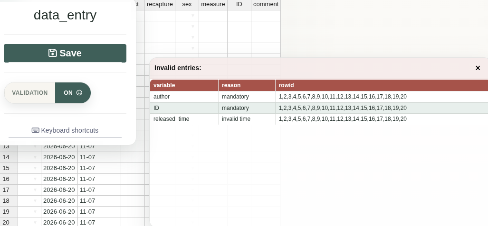

DataEntry: Data Entry interfaces.
------------


The data entry backend is a `MariaDB` database so more people can enter data simultaneously.
The frontends are UI-s (one per table) based on [shiny](https://cran.r-project.org/package=shiny) and [rhandsontable](https://cran.r-project.org/package=rhandsontable).

Individual checks are done by `validators`.
A collection of `validators` makes an `inspector`.
Data is checked *before* it is saved to the DB by the `inspector`.
Each time the `inspector` runs, the *exact* position of the offending cell(s) and the reasons for errors are returned.

Validation is kept in the data entry layer because unusual observations are not always mistakes.
Hard database constraints are useful for structural integrity, but they can also make it impossible to record a real but unexpected observation in the field.

The user can bypass the data validation.
However the entries saved without validation are flagged in the database and the user is encouraged to explain why the validation was ignored.
The aim is to make questionable data visible and traceable, not to silently discard observations that may be real.

## The package includes three Shiny apps:

```r

shiny::runApp(
  system.file("UI", "newData", package = "DataEntry"),
  launch.browser = TRUE
)

shiny::runApp(
  system.file("UI", "editData", package = "DataEntry"),
  launch.browser = TRUE
)

shiny::runApp(
  system.file("UI", "editInspector", package = "DataEntry"),
  launch.browser = TRUE
)

```

These apps expect the test database configured by:
```r
system.file("UI", ".testdb.R", package = "DataEntry")
```
The SQL installer for the `data_entry_tests` database is available at:
```r
system.file("database", "install_testdb.sql", package = "DataEntry")
```
From a shell, install it with something like:
```sh
mariadb -u root -p < path/to/install_testdb.sql
```
The SQL creates the `data_entry_tests` database, the test user, and the
tables used by the example apps.

<hr>




## Installation

``` R

install.packages("remotes")
remotes::install_github("ornitho-logics/DataEntry")

```
